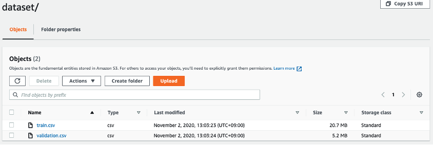
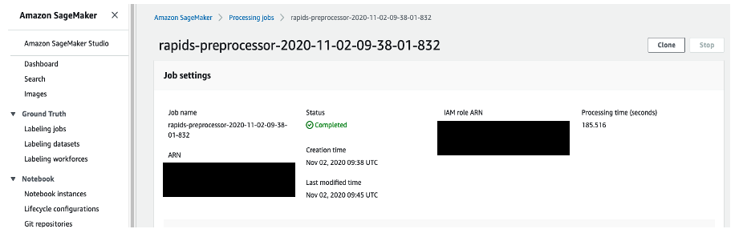

# How to use RAPIDS on Amazon SageMaker

Hi I’m Atsunori, This article introduces Amazon SageMaker and RAPIDS, a GPU-accelerated framework for data science workflows. Both are compatible. And I love RAPIDS, which realizes GPU processing with a familiar API.

## Benefits of using Amazon SageMaker

Amazon SageMaker saves wasted development costs by choosing the right instances for coding and feature engineering, training, and inference.
Simply put, Amazon SageMaker saves money by running coding and calculations on different instances.
This is especially true when using the GPU. You don't want to pay a lot for coding time.


If you use SageMaker, you can only use the GPU when using huge resources such as feature engineering and training.

## What is Amazon SageMaker Processing?

Amazon SageMaker Processing is a Python SDK that makes it easy to perform workflows such as pre-processing, feature engineering, and post-processing, (but also training, inference) on Amazon SageMaker.
All you have to do is prepare the container images and processing code and run it from Amazon SageMaker.

The following classes are available in the Python SDK ([see detailed documentation here](https://sagemaker.readthedocs.io/en/stable/amazon_sagemaker_processing.html)).

* **`sagemaker.processing.Processor`**
* **`sagemaker.processing.ScriptProcessor`**
* **`sagemaker.sklearn.processing.SKLearnProcessor`**
* **`sagemaker.processing.PySparkProcessor`**

SKLearnProcessor and PySparkProcessor are classes that use the prepared scikit-learn and PySpark containers, respectively.
[Here is an example](https://aws.amazon.com/jp/blogs/aws/amazon-sagemaker-processing-fully-managed-data-processing-and-model-evaluation/).

**`Processor`** and **`Script Processor`** can be processed in your own container.

* Processor class is a class that does not take a code argument (python code) in the .run () method, and uses docker images by describing the process you want to create and execute in Docker images ([see an example)](https://docs.aws.amazon.com/sagemaker/latest/dg/build-your-own-processing-container.html).

* ScriptProcessor class creates a container and executes the processing code separately. Prepare a container in advance, pass a python code to the .run () method in the same way as SKLearnProcessor and PySparkProcessor, and execute the process.

In this article, we will use the ScriptProcessor class to prepare docker images that can execute RAPIDS and run preprocessing and feature engineering.
[The notebook used in this article can be found here](https://github.com/aws-samples/amazon-sagemaker-examples-jp/tree/master/sagemaker_processing/Feature_engineering_with_RAPIDS_on_SageMaker_Processing)(This notebook is written in Japanese. If you need english please contact me).

* **Note**: Use an instance type of ml.t2.large (vCPU2, 8GB of memory) or higher for the notebook instance that runs this notebook. For ml.t2.medium (vCPU2, memory 4GB), a memory error occurs when building the docker container.

## About the dataset

We use [the Census-Income(KDD) Data Set](https://archive.ics.uci.edu/ml/datasets/Census-Income+(KDD)).
In this dataset, we set "income" as the target variable and solve the task of classifying whether the income of census respondents exceeds $50,000.

## Docker images settings

After launching an Amazon SageMaker notebook instance([how to get start](https://docs.aws.amazon.com/sagemaker/latest/dg/gs-set-up.html)), first create docker images. The docker images you create will be those that include version 0.16 of RAPIDS in miniconda.

```docker
FROM continuumio/miniconda3:4.8.2

RUN conda install -c rapidsai -c nvidia -c conda-forge -c defaults rapids=0.16 python=3.7 cudatoolkit=10.1 boto3

ENV PYTHONUNBUFFERED=TRUE
ENTRYPOINT ["python3"]
```

Then push the docker images you created to Amazon ECR, the AWS container registry.

```python
account_id = boto3.client('sts').get_caller_identity().get('Account')
region = boto3.session.Session().region_name

ecr_repository = 'sagemaker-rapids-example'
tag = ':latest'
uri_suffix = 'amazonaws.com'
if region in ['cn-north-1', 'cn-northwest-1']:
    uri_suffix = 'amazonaws.com.cn'
rapids_repository_uri = '{}.dkr.ecr.{}.{}/{}'.format(account_id, region, uri_suffix, ecr_repository + tag)

# Create ECR repository and push docker image
!$(aws ecr get-login --region $region --registry-ids $account_id --no-include-email)
!aws ecr create-repository --repository-name $ecr_repository
!docker tag {ecr_repository + tag} $rapids_repository_uri
!docker push $rapids_repository_uri
```

## Coding the process

After pushing docker images is complete, create the script you want to run on the container.
Here, We would like to use cuDF and cuML of RAPIDS to read dataset and run LabelEncoding and TargetEncoding for categorical variables.
The script name is preprocess.py.

```python
%%writefile preprocess.py
from __future__ import print_function, unicode_literals

import boto3
import os
import sys
import time

import cudf
from cuml.preprocessing.LabelEncoder import LabelEncoder
from cuml.preprocessing.TargetEncoder import TargetEncoder

import warnings
warnings.filterwarnings("ignore")


if __name__ == "__main__":

    # Get processor script arguments
    args_iter = iter(sys.argv[1:])
    script_args = dict(zip(args_iter, args_iter))

    TARGET_COL = script_args['TARGET_COL']
    TE_COLS = [x.strip() for x in script_args['TE_COLS'].split(',')]
    SMOOTH = float(script_args['SMOOTH'])
    SPLIT = script_args['SPLIT']
    FOLDS = int(script_args['FOLDS'])

    # Read train, validation data
    train = cudf.read_csv('/opt/ml/processing/input/train/train.csv')
    valid = cudf.read_csv('/opt/ml/processing/input/valid/validation.csv')

    start = time.time(); print('Creating Feature...')

    # Define categorical columns
    catcols = [x for x in train.columns if x not in [TARGET_COL] and train[x].dtype == 'object']

    # Label encoding
    for col in catcols:
        train[col] = train[col].fillna('None')
        valid[col] = valid[col].fillna('None')
        lbl = LabelEncoder()
        lbl.fit(cudf.concat([train[col], valid[col]]))
        train[col] = lbl.transform(train[col])
        valid[col] = lbl.transform(valid[col])

    # Target encoding
    for col in TE_COLS:
        out_col = f'{col}_TE'
        encoder = TargetEncoder(n_folds=FOLDS, smooth=SMOOTH, split_method=SPLIT)
        encoder.fit(train[col], train[TARGET_COL])
        train[out_col] = encoder.transform(train[col])
        valid[out_col] = encoder.transform(valid[col])

    print('Took %.1f seconds'%(time.time()-start))

    # Create local output directories
    try:
        os.makedirs('/opt/ml/processing/output/train')
        os.makedirs('/opt/ml/processing/output/valid')
    except:
        pass

    # Save data locally
    train.to_csv('/opt/ml/processing/output/train/train.csv', index=False)
    valid.to_csv('/opt/ml/processing/output/valid/validation.csv', index=False)

    print('Finished running processing job')
```

## Run SageMaker Processing

To run this code, pass the URI of the container repository you created earlier to the image_uri argument of the ScriptProcessor class. Next, specify GPU as the instance type and create an object with any name.

We are going to use ml.p3.2xlarge from now on.
ml.p3.2xlarge is an instance of one NVIDIA Tesla V100, but RAPIDS also supports multiple GPUs, so if you use p3.8xlarge(4 * NVIDIA Tesla V100) and rewrite preprocess.py can use multi-GPUs.

```python
from sagemaker.processing import ProcessingInput, ProcessingOutput, ScriptProcessor

rapids_processor = ScriptProcessor(
    role=role,
    image_uri=rapids_repository_uri,
    command=["python3"],
    instance_count=1,
    instance_type="ml.p3.2xlarge", # use GPU Instance
    volume_size_in_gb=30,
    volume_kms_key=None,
    output_kms_key=None,
    max_runtime_in_seconds=86400, # the default value is 24 hours(60*60*24)
    base_job_name="rapids-preprocessor",
    sagemaker_session=None,
    env=None,
    tags=None,
    network_config=None)
```

Then execute .run() on the created object.

* Pass preprocess.py as the code argument.
* The source of inputs is the PATH of S3 where the input file is located, and the destination is the location of the file on the container.
* Specify the location on the container of the file you want to output in the source of outputs, and specify the PATH of S3 where the file you want to output is placed in destination.
* Arguments can optionally be set to the arguments to be passed in the script (preprocess.py). This time, the name of the target variable used for TargetEncoding, the variable name for TargetEncoding, hyperparameters, etc. are set, but these can also be hard-coded in preprocess.py.

Also, inputs and outputs do not necessarily have to be set, you can get a file from the Internet in preprocess.py, do some processing and output it, or train a machine learning model from the input file. It can also be used for such things.

```python
rapids_processor.run(
    code="preprocess.py",
    inputs=[
        ProcessingInput(source=input_train, destination='/opt/ml/processing/input/train'),
        ProcessingInput(source=input_validation, destination='/opt/ml/processing/input/valid')
    ],
    outputs=[
        ProcessingOutput(source='/opt/ml/processing/output/train', destination=output_s3_path),
        ProcessingOutput(source='/opt/ml/processing/output/valid', destination=output_s3_path)
    ],
    arguments=[
        'TARGET_COL', 'income',
        'TE_COLS', 'class of worker, education, major industry code',
        'SMOOTH', '0.001',
        'SPLIT', 'interleaved',
        'FOLDS', '5'
    ],
    wait=True,
    logs=True,
    job_name=None,
    experiment_config=None,
    kms_key=None
)
```

When this Job is completed, the preprocessed and feature-engineered files should be output with the names train.csv and validation.csv in the output_s3_path given to the destination of outputs.



You can also check the Job details from the SageMaker console. This process takes about 186 seconds and you will be charged ml.p3.2xlarge for this time.



## Conclusion

With Amazon SageMaker, you don't have to spend a lot of money on coding time.
You coded on a ml.t2.large instance (vCPU2, 8GB of memory) and used ml.p3.2xlarge (1 * NVIDIA Tesla V100) only for calculations.

If you're training huge machine learning model in SageMaker, consider **`Estimator`** and **`Framework(Pytorch, Tensorflow, MXNet)`** classes. It has features such as Spot Instances, HPO, etc. that make your development even more efficient.

We hope you enjoy machine learning!
