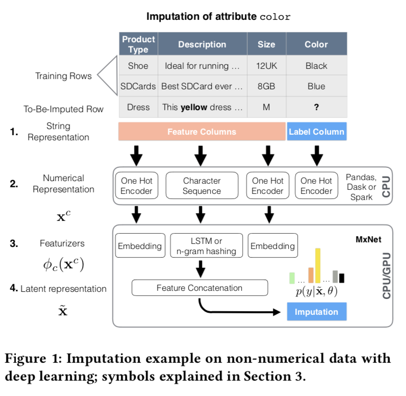
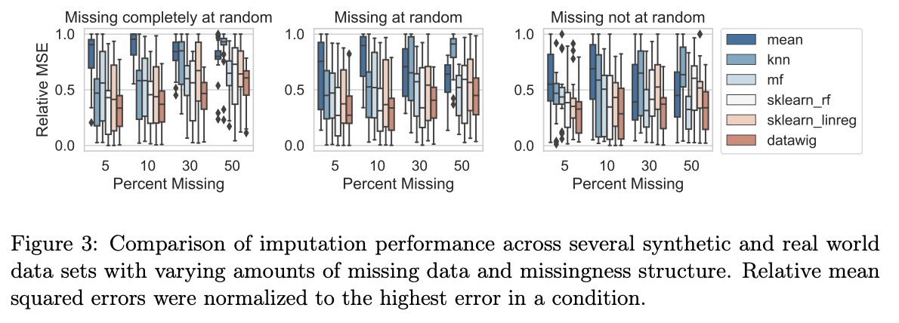

# Missing value imputation using DataWig

Recently, there are frameworks that work even if they contain missing values.
But yet dealing with missing values is one of the difficult challenges in applying machine learning.

There are simple methods such as replacing statistics for instance mean, median, and mode. Filling values with machine learning algorithms using Scikit-learn's API or MICE.
In this article, I would like to talk on DataWig, a deep learning-based missing value imputation library.

## Types of Missing value

It is said that there are three major mechanisms for missing value.

### MCAR(Missing Completely At Random）

It is a completely random missing value, and the probability of missing a value is independent of that data.
(e.g. a situation where the dice are rolled and the data is randomly missing).
If you can secure enough data, you can delete the missing rows without any problem.

### MAR (Missing At Random)

Conditionally random missing. Missing values are meant to occur depending on other information.
(e.g. The older person, the more likely the missing values in the income column)

### MNAR (Missing Not At Random)

Non-random missing. It means that the probability of missing a value depends on the value of the variable itself.
(e.g. the higher income person, the more likely the income values is missing).

MAR and MNAR are the types of missing value that are biased when build a model by deleting the missing rows.
It is difficult to understand which type of missing value at hand corresponds to, but the main approach to missing value imputation is to use the information of other variables to complete.

## What is Data Wig

Paper: ["Deep" Learning for Missing Value Imputation in Tables with Non-Numeric Data](https://www.amazon.science/publications/deep-learning-for-missing-value-imputation-in-tables-with-non-numeric-data)    
Paper: [DataWig: Missing Value Imputation for Tables](https://www.jmlr.org/papers/volume20/18-753/18-753.pdf)    
GitHub: https://github.com/awslabs/datawig    
Docs: https://datawig.readthedocs.io/en/latest/index.html    

DataWig is an OSS missing value imputation library developed by Amazon and is based on Apache MXNet.
The main features are as below.

* Suitable for filling missing values in large datasets because of based on deep learning
* Supports not only numerical values but also category missing value imputation
* Create an imputation model from numerical, category, and text variables
* Easy to use with Pandas DataFrame as input
* Operates on CPU and GPU

The approach of missing value imputation is the same as MICE, which is to obtain the likelihood of the potential values of all the attributes or all the column you want to impute, based on the imputation model and the information extracted from other columns.

```math
p (color = yellow | othercolumns, imputationmodel)
```

The figure below is used as a feature of the assignment model by numerically expressing categorical variables and text variables in the architecture.

#### DataWig architecture
    

#### DataWig performance
The paper said that the performance was good when compared to other methods.



## How to use DataWig

You can install from pip.

```python
pip install datawig
```


DataWig `SimpleImputer` is an easy-to-use API (there is `Imputer` class that is a bit more complicated but can be flexible).
When creating an object from `SimpleImputer`, specify which features to use(`input_columns`), which column to impute(`output_column`), and where to output the imputation model(`output_path`).
The other arguments have default values, so they will work without them.

```python
import datawig

imputer = datawig.SimpleImputer(
    input_columns=input_columns,
    output_column=output_column,
    output_path='imputer_model',
    num_hash_buckets=int(2 ** 15),
    num_labels=100,
    tokens='chars',
    numeric_latent_dim=100,
    numeric_hidden_layers=1,
    is_explainable=False
)
```

The `SimpleImputer` object takes a Pandas DataFrame as input.    
**Note: assuming the train_df output_column is a complete DataFrame**

DataWig determines the data types of the imputation model from the Pandas dtype.

If `test_df` is specified, that data will be used to verify the accuracy of the imputation model. If not specified, random sampling is excecuted from train_df at the ratio of `test_split` to verify the accuracy.
You can use `fit_hpo()` instead of `fit()` to create an HPO for the imputation model.


```python
import mxnet as mx

imputer.fit(train_df=train_df,
            test_df=None,
            ctx=[mx.cpu()],
            learning_rate=4e-3,
            num_epochs=100,
            patience=3,
            test_split=0.1,
            weight_decay=0
           )
```


Inference (missing value imputation) can be performed after learning the imputation model.
You can also use `explain()` to get columns that are relevant in predicting the output_column of the imputation model.

For imputation, you can output the impute value as it is for numeric variables, and the category and probability for categorical variables.

In addition, in the case of categorical variables, filtering is possible with `Precision_threshold`, and it is also possible to output lines that are below the set threshold without assigning them as missing.
By the way, it can be reused by `load()` the output imputation model.

```python
test_df = imputer.predict(test_df,
                     precision_threshold=0.0,
                     imputation_suffix="_imputed",
                     score_suffix="_imputed_proba",
                     inplace=False
                    )
```


If it is bothered to impute missing variables one by one, you can use `complete()` method that applies for all the missing variables (it will take time).
Internally, for each variable, It will create an imputation model with a complete dataset.


```python
df = datawig.SimpleImputer.complete(df,
                                    precision_threshold=0.0,
                                    inplace=False,
                                    hpo=False,
                                    verbose=0,
                                    num_epochs=100,
                                    iterations=1,
                                    output_path='.'
                                   )
```

## Important point of using DataWig

The DataWig document requires at least 10 times more rows than the unique number of categories to impute missing values for categorical variables.
In my experiment, it seems difficult to impute a category that appears extremely infrequently within a categorical variable.

## Conclusion

This article covered DataWig, a deep learning-based missing value imputation library. I hope it will be one of the options for missing value imputation.
