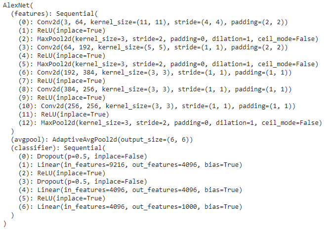

Transfer learning
=================

The present decade has made leaps in the area of Deep Learning research, making automating many arduous tasks. However, these highly accurate models require weeks of training on large cloud clusters/GPU machines that consume a lot of compute resources. But, there is a silver lining; the AI community has been open-source from the start with most of the model details and trained parameters available for use.

In the area of NLP, one can train and fine-tune their language models using the [Hugging Face](https://huggingface.co/) library. In this article, we apply transfer learning to an Image Classification task using pre-trained model weights and fine-tuning to our case from start to end. The steps are:

## STEP 1: Analyze the approach

1. Trained model selection

This is the most important part of one's research: to determine the best-fit scenario for our application. For example, a CNN model trained for **Adversarial networks** might not be able to solve an **Image Classification** task with the same high accuracy. Thus, a thorough research on type of dataset the models were trained on and similarity with our problem is necessary to select the best candidate.

2. Training approach

The following guide helps in finalizing our approach


In the case of Computer Vision tasks, if the data is:
- SMALL and SIMILAR: Fine-tune last layers
- SMALL and DIFFERENT: Fine-tune initial layers that learns low-level features like curves
- LARGE and SIMILAR: Fine-tune last layers or the entire network
- LARGE and DIFFERENT: Retrain from the trained model's checpoint

Similarly, in the case of NLP tasks, we can utilize the pretrained word embeddings and train the rest based on our model architecture. 
In addition, the approach can also be determined based on the compute resources and time available.

## STEP 2: Preparing the dataset

Alongwith the model research, understanding of the input is very essential to help us pre-process the data for the pretrained model. Lets try an Image Classification task using PyTorch.

```python
import os, os.path as osp
import matplotlib.pyplot as plt
from matplotlib import cm
import cv2 
import numpy as np
import pandas as pd
from tqdm import tqdm

import torch
import torch.nn as nn
import torch.nn.functional as F
from torch.utils.data import Dataset, DataLoader, random_split
from torch import Tensor
from torch.nn import MSELoss, Linear, ReLU, Sigmoid, Module, BCELoss
from torch.optim import SGD, Adam
from torchvision import datasets, models, transforms
import torchvision

device = torch.device("cuda:0" if torch.cuda.is_available() else "cpu")
```

We get a dataframe with info of our data called `train_df` with 2 columns:
- **filename**: of all images
- **target**: respective target labels (ex: cat, dog, etc.) from our dataset

Let's create an encoder for the target variable

```python
from sklearn import preprocessing

categories = train_df.targets.unique()

label_encoder = preprocessing.LabelEncoder()
label_encoder.fit(categories)
```

Next is the part of creating a basic Dataset for training the model. The main requirements are the `__len__` and `__getitem__` functions and we can add other functions for convenience. We can then use a DataLoader for easy shuffling and batch size management.

```python
class ImageDataset(torch.utils.data.Dataset):
    'Generates data for PyTorch'
    def __init__(self, folder):
        self.folder = folder
        self.files = os.listdir(self.folder)

    def __len__(self):
        return len(self.files)

    def __getitem__(self, index):
       
        file = self.files[index]

        # X
        image_loc = os.path.join(self.folder, file)
        image = cv2.imread(image_loc)
        image_tensor = torchvision.transforms.functional.to_tensor(image)

        ''' Additional transforms can be made if data input doesn't match model input layer like:

        transform=transforms.Compose([
            SquarePad(),
            transforms.Resize(self.image_size),
            transforms.CenterCrop(self.image_size),
            transforms.ToTensor(),
        ])
        image_tensor = transform(image_tensor)
        '''

        # Y
        file_ID = int(file[:-4]) # Filename w/o extension
        y = label_encoder.transform(train_df.loc[file_ID].values)
        y = torch.tensor(y[0])  

        return image_tensor, y

train_dataset = ImageDataset(train_folder)

params = {
    'batch_size': batch_size,
    'shuffle': True,
    'num_workers': 6
  }
max_epochs = 100

train_loader = DataLoader(train_dataset, **params)
```

## STEP 3: Loading the pre-trained models

From `torchvision`, we can load various [pre-trained models](https://pytorch.org/docs/stable/torchvision/models.html) based on our usage. Let's say we plan to use the AlexNet model as: 

```python
model = models.alexnet(pretrained=True)

for param in model.features.parameters():
    param.requires_grad = False
```

On printing the model, the architecture looks like:



As seen, the trained model has named features that can be easily accessed and manipulated (we already freezed the features layer from training above) for our case as:

```python
# Adding our required number of categories to the final layer

# Get number of inputs for the last layer
n_inputs = model.classifier[6].in_features
final_layer = nn.Linear(n_inputs, len(categories))

model.classifier[6] = final_layer
model.to(device)
```

And that's it! After this, the model can be trained like any other Torch model made from scratch

```python
def train(n_epochs, train_loader):
    
    model.train()
    for epoch in tqdm(range(n_epochs)):
        for (image_tensor, target) in tqdm(train_loader):
                output = model(data.to(device))
                loss = criterion(output, target.to(device))
                loss.backward()
                optimizer.step()
                train_loss += loss.item()
                ...
```

## Notable Research with Transfer Learning

A common focus in the deep learning community is in *"Democratizing deep learning with transfer learning"*

These are some noteworthy researches using transfer learning:
- In 2017, a highly accurate model for [Predicting breast cancer](https://www.nature.com/articles/nature21056.epdf) was fine-tuned on Google’s Inception v3 CNN architecture. 
- A recent paper on [Drug discovery](https://pubs.acs.org/doi/abs/10.1021/acs.jmedchem.9b02147) using transfer learning in multiple domains based on tasks.
- The largest application on transfer learning in the past few years has been on NLP that can be adapted to any language modeling task using [Transformer models](https://www.aclweb.org/anthology/N19-5004.pdf).
