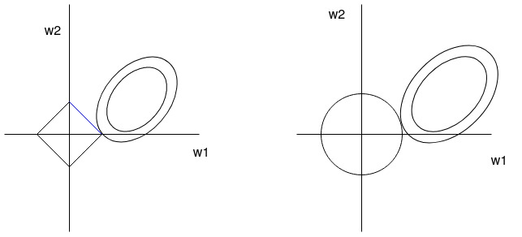

# A Deeper Understanding of Linear Regression

When we begin our Machine Learning journey, one of the first algorithms that we come across is linear regression. In this blog I will start things from a beginner level and gradually try to indulge into some deeper aspects of linear regression, which will make you admire the brilliance of this **"simple"** algorithm. So, let's begin!

## Regression problem
A regression problem is where we need to predict a continuous real value for a target variable. A simple example is house price prediction.

## Linear Regression
Given some features  (  in the dimensionality of the data),  we need to predict a target variable . Linear regression proposes to linearly weigh the input features so as to predict the target variable. Mathematically, it can be formulated as

where  is the weight for the  feature,  is the predicted value

You can observe that the weight vector also has dimensionality . Moreover, if both the input features and the weights are represented as vectors  and  respectively, they can be expressed as the dot product of the two vectors

People often introduce a bias term  into the above equations. The bias term is a constant value that is added to get a better prediction for the target variable. It is analogous to the intercept of a straight line in 2-dimensions. For simplicity we will ignore the bias term in our discussion.

The above equations are for a single instance. In machine learning, we encounter dataset with many instances. Hence, there is a need to process multiple instances in one go. We will now convert these operations into a matrix product operation.

Let us assume our dataset has  instances, each having  features. We represent our data as  of dimenision ( x ). Our weights of linear regression are represented as , which is a vector of dimension . Our output predictions  can be written as

We can check that ( x ) matrix multiplied by  dimension vector will yield an output of ( x 1), i.e. 1 value for each of our  instances. To introduce the bias term here, a new feature which is always equal to 1 can be added along with the increase in 1 dimension for .

Now, we will look into how we can train our linear regression algorithm. Linear regression is trained using least Mean Square Error (MSE). For data with  instances, MSE is defined as :

MSE can also be represented in terms of matrix operations:

Applying transpose,

Expanding,

Since we need minimal MSE w.r.t. , we need to differentiate MSE w.r.t.  and set the derivative to 0.

Equating derivative to 0, we get

Applying transpose to both sides of the equation

Finally, we obtain the expression of our  vector for which we obtain minimum MSE.

This solution is also called the **closed form** solution for linear regression. The solution for linear regression can also be obtained via an iterative optimization technique, called **Gradient Descent**. We also take a quick look into how it is done.

Our MSE loss equation can be written as,

whose derivative w.r.t.  can be written as

We can verify the above equation: the derivative of a scalar w.r.t a vector is a vector of the same size (in this case ). The quantity within parentheses is a scalar quantity multiplied with , which is of dimension . The weighted vector is then averaged across the data points. This derivative is used to update  as

where  is a hyper-parameter called the learning rate. The learning rate adjusts the magnitude of updates that occur to . This updating process is repeated till convergence or for a fixed number of iterations to get the optimal .

## Andrew Ng's drawing of concentric ellipses

If you have seen Andrew Ng's lectures on Linear Regression, you might remember him drawing concentric ellipses and explaining how gradient descent works. Now, we will figure out why he draws ellipses and not any other conic section or shape. **Get ready for some heavy mathematics!!**

Let us represent our MSE loss function as a function of  :

We represent the optimal  as , which is equal to

Let us start exploring the expression

 has a shape of (1 x ) ,  has shape ( x ) and  has shape  ( x ). Hence, this expression is a scalar as its shape is (1x1).

Applying transpose,

Expanding the RHS of the equation

Now  and  are same using the property  if  is scalar. Our RHS becomes

From our closed form solution of linear regression,

Using the above relation in our RHS, we get

Now adding and subtracting 

Therefore, we can write our complete equation as

Now let us look at what the minimal loss would be as per .

We can prove that  = 

Using the above values,

Moreover,  can be simplified as

Therefore, we get the following expression for :

Finally, for the bigger picture we have:

If we look into the matrix equation of an ellipsoid, we see some similar expression:  which represents an ellipsoid if  is symmetric and positive semi-definite.

A symmetric matrix  is positive semi-definite if  non-zero vectors , .

 is symmetric and we can prove that it is positive semi-definite as follows:

Hence,  can be represented with a ellipse if we are working in 2-dimensions. It must also be noted that the center of the ellipse is . There exist different ellipses for different values of , however each will have its center at . This is the mathematical explanation why Andrew Ng draws concentric ellipses centered at .

## Regularization

The two main regularization for linear regression are Lasso ( regularization) and Ridge ( regularization). Regularization is a technique which helps us prevent over-fitting by penalizing the complexity of model, i.e. it tries to keep the models simple.

For lasso, the optimization objective becomes  whereas for ridge it comes , where  is co-efficient of regularization. We can graphically interpret what the objective tries to do in both the cases. Assuming that we are working in 2-D space, the 2 objectives can be visualized as shown in the figure below.

The constraint of lasso can be converted as  and of ridge .  is related to  here. A larger value of  will force our  to be smaller, implying a smaller . These constraints can be interpreted as a square and a circle for lasso and ridge respectively (as depicted in the above figure). For lasso, we can observe that the the ellipse (our MSE objective) can intersect the square at the axis. If it happens, then one of the components of  **is set exactly to 0**. This implies that there is no contribution of the corresponding input feature in prediction of the target. The intersection at the axis is only possible because of the sharp corners of the square. In the case of ridge, the closest that can happen is one of the components of  **being set near to 0, but not exactly 0**. Thus, lasso gives sparse solutions and this property of lasso can be used a **feature selection technique**. The weights of less important features will be reduced to 0 and can be eliminated.

## You have made it to the end!!

In this blog, I have tried to share with you the cool stuff about linear regression that I have come across. I am pretty sure there is much more to linear regression. Do let everyone know about some more interesting things about linear regression in the comment section!
