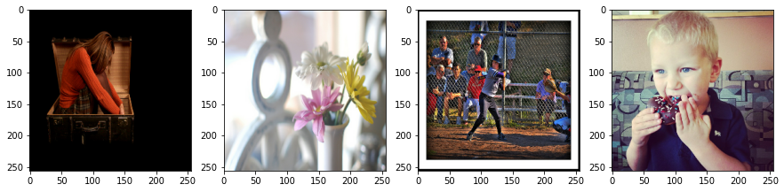
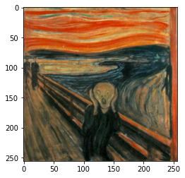
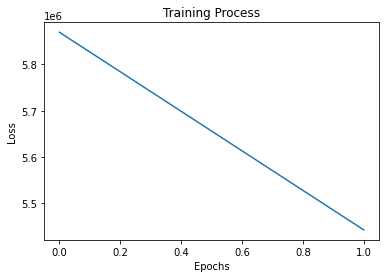
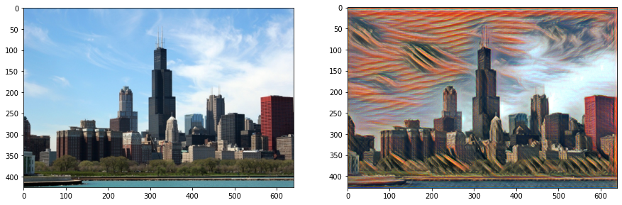
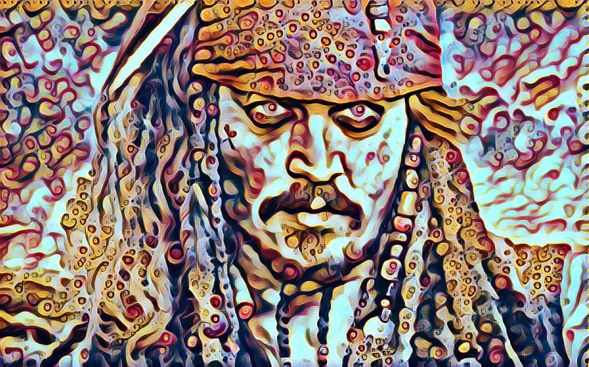

# Neural Style Transfer Part 2 : Fast Style Transfer

This is the second part of neural style transfer in this part we are dealing with another technique of style transfer which we can call Fast Style Transfer. This is follow up from the previous post if you are directly reading its second part then I recommend you to read the previous part first as many topics are followed up from that post.

In gatys style transfer, we are not training any network, we are just optimizing output image with respect to loss function(style_loss + content_loss) and optimization takes some number of rounds because of this it is a very slow process to generate the styled image. Using that technique for realtime videos 😭 forget about it. 

This seems to be an iterative process if we want to generate multiple images of the same style as we are optimizing output image for the same style image every time. If there is a way to learn this input-output mapping for a style image then we can generate images of that style in one go. 🤔 Yes, we have we can use an autoencoder to learn the mapping between the input image and styled output image by using the previously defined loss function to train it.  

Fast style transfer let us train once and generate infinite images and yes we can use this for styling videos, even realtime webcam videos too.

### Important Points

Fast style transfer let us train once and generate infinite images. Most of the points that we discussed regarding the theory of loss function is same, the main difference here is we will focus more is training model and learning mapping using that loss function.

Before reading this post brushup your knowledge about autoencoder especially convolutional autoencoders and residual layers (skip connections) in deep learning because I will not be explaining them but we will be implementing them here so cover up some basic knowledge about convolutional autoencoders and residual layers first this will help to understand implementation easily 

- We train a feedforward network that applies artistic styles to images using loss function defined in [Gatys et al](https://arxiv.org/abs/1508.06576) paper, for more explanation refer to the previous post.

- Feedforward network which we will use is a residual autoencoder network that takes the content image as input and spits out a stylized image this is the same network that was used in [original implementation](https://arxiv.org/abs/1603.08155)

- Model also uses instance normalization instead of batch normalization based on the paper [Instance Normalization: The Missing Ingredient for Fast Stylization](https://arxiv.org/abs/1607.08022) as this provides better results.

- We will be using vgg19 to calculate perceptual loss more working described on paper. 

If someone wants to try style transfer in video and images right now, I have created a [github repository](https://github.com/tarun-bisht/fast-style-transfer) for the same purpose with instructions.

### Importing Necessary Modules

Let's start by importing all necessary modules:

- `numpy`: for arrays manipulation
- `tensorflow`: for tensor operations
- `tensorflow.keras`: high-level neural network library for tensorflow for creating neural networks
- `pillow`: for converting an image to numpy array and numpy array to image, saving out output image.
- `time`: for calculating the time of each iteration
- `matplotlib`: for displaying images and graphs in notebook
- `request`, `base64`, `io`: for downloading and loading image from URL
- `os`: operating system level commands


```python
import numpy as np
import tensorflow as tf
from tensorflow.keras.applications import vgg19
from tensorflow.keras.models import load_model,Model
from PIL import Image
import time
import matplotlib.pyplot as plt
import matplotlib
import requests
import base64
import os
from pathlib import Path
from io import BytesIO
matplotlib.rcParams['figure.figsize'] = (12,12)
matplotlib.rcParams['axes.grid'] = False
```

### Define Utility Functions


```python
def load_image(image_path, dim=None, resize=False):
    img= Image.open(image_path)
    if dim:
        if resize:
            img=img.resize(dim)
        else:
            img.thumbnail(dim)
    img= img.convert("RGB")
    return np.array(img)
```

The above function is used to load image from the path specified and convert it into numpy array


```python
def load_url_image(url,dim=None,resize=False):
    img_request=requests.get(url)
    img= Image.open(BytesIO(img_request.content))
    if dim:
        if resize:
            img=img.resize(dim)
        else:
            img.thumbnail(dim)
    img= img.convert("RGB")
    return np.array(img)
```

This function loads the image from URL and converts it into numpy array


```python
def array_to_img(array):
    array=np.array(array,dtype=np.uint8)
    if np.ndim(array)>3:
        assert array.shape[0]==1
        array=array[0]
    return Image.fromarray(array)
```


```python
def show_image(image,title=None):
    if len(image.shape)>3:
        image=tf.squeeze(image,axis=0)
    plt.imshow(image)
    if title:
        plt.title=title
```


```python
def plot_images_grid(images,num_rows=1):
    n=len(images)
    if n > 1:
        num_cols=np.ceil(n/num_rows)
        fig,axes=plt.subplots(ncols=int(num_cols),nrows=int(num_rows))
        axes=axes.flatten()
        fig.set_size_inches((15,15))
        for i,image in enumerate(images):
            axes[i].imshow(image)
    else:
        plt.figure(figsize=(10,10))
        plt.imshow(images[0])
```

Above three functions are used for converting and plotting images:
- `array_to_img`: Converts an array to image
- `show_image`: plot single image
- `plot_images_grid`: plots batches of images in grid

### Steps for fast style transfer

The training model is an encoder-decoder architecture with residual layers. Input images are passed to encoder part and it propagates to decoder part. The output is the same size as input and spits generated image. 

This model is trained on a loss which is called perceptual loss, the loss is calculated in the same way as we calculate in gatys style transfer. Using a pre-trained model to extract feature maps from style and content layers defined and using them to calculate style loss and content loss. (For more detail read the previous post it was explained there)

As part of training the model we need training data, For training model, we need a dataset of different images(can be anything like a person, dog, car etc..) in bulk. In this post, we are using [coco dataset](http://images.cocodataset.org/zips/train2014.zip) which have lots of images. I have also used [kaggle challenge dataset](https://www.kaggle.com/c/gan-getting-started) which has images of different landscapes, you can check code kernel [here](https://www.kaggle.com/tarunbisht11/generate-art-using-fast-style-transfer-in-a-second). We also need a style image whose style we want to learn using autoencoder. We can use any painting or sketch (select one from the internet)

For training, this model we send a batch of input training images of various contents into autoencoder which provides us output this output has to be our styled image, while training we pass these output images batches into our loss model (vgg19) in our case and features from different layers were extracted (content layers and style layers) these features are then used to calculate style loss and content loss, whose weighted sum produce perceptual loss that trains the network. The below image from paper describes it well.


After training, we can use that network for styling any image in one pass without the need of optimization

The main highlights of the network:
- Residual Layers
- Encoder-Decoder Model
- output from decoder is passed to loss model(VGG) to calculate the loss
- training needs compute as we are passing these images to two networks on every step

### Define loss 

For calculating style loss and content loss we need a pre-trained model, we are using vgg19 the original implementation uses vgg16.


```python
vgg=vgg19.VGG19(weights='imagenet',include_top=False)
vgg.summary()
```

    Model: "vgg19"
    _________________________________________________________________
    Layer (type)                 Output Shape              Param #   
    =================================================================
    input_1 (InputLayer)         [(None, None, None, 3)]   0         
    _________________________________________________________________
    block1_conv1 (Conv2D)        (None, None, None, 64)    1792      
    _________________________________________________________________
    block1_conv2 (Conv2D)        (None, None, None, 64)    36928     
    _________________________________________________________________
    block1_pool (MaxPooling2D)   (None, None, None, 64)    0         
    _________________________________________________________________
    block2_conv1 (Conv2D)        (None, None, None, 128)   73856     
    _________________________________________________________________
    block2_conv2 (Conv2D)        (None, None, None, 128)   147584    
    _________________________________________________________________
    block2_pool (MaxPooling2D)   (None, None, None, 128)   0         
    _________________________________________________________________
    block3_conv1 (Conv2D)        (None, None, None, 256)   295168    
    _________________________________________________________________
    block3_conv2 (Conv2D)        (None, None, None, 256)   590080    
    _________________________________________________________________
    block3_conv3 (Conv2D)        (None, None, None, 256)   590080    
    _________________________________________________________________
    block3_conv4 (Conv2D)        (None, None, None, 256)   590080    
    _________________________________________________________________
    block3_pool (MaxPooling2D)   (None, None, None, 256)   0         
    _________________________________________________________________
    block4_conv1 (Conv2D)        (None, None, None, 512)   1180160   
    _________________________________________________________________
    block4_conv2 (Conv2D)        (None, None, None, 512)   2359808   
    _________________________________________________________________
    block4_conv3 (Conv2D)        (None, None, None, 512)   2359808   
    _________________________________________________________________
    block4_conv4 (Conv2D)        (None, None, None, 512)   2359808   
    _________________________________________________________________
    block4_pool (MaxPooling2D)   (None, None, None, 512)   0         
    _________________________________________________________________
    block5_conv1 (Conv2D)        (None, None, None, 512)   2359808   
    _________________________________________________________________
    block5_conv2 (Conv2D)        (None, None, None, 512)   2359808   
    _________________________________________________________________
    block5_conv3 (Conv2D)        (None, None, None, 512)   2359808   
    _________________________________________________________________
    block5_conv4 (Conv2D)        (None, None, None, 512)   2359808   
    _________________________________________________________________
    block5_pool (MaxPooling2D)   (None, None, None, 512)   0         
    =================================================================
    Total params: 20,024,384
    Trainable params: 20,024,384
    Non-trainable params: 0
    _________________________________________________________________
    

Here we define layers that we will use to calculate the loss.


```python
content_layers=['block4_conv2']

style_layers=['block1_conv1',
            'block2_conv1',
            'block3_conv1',
            'block4_conv1',
            'block5_conv1']
```

Let's define a class that creates a loss model with some additional methods for accessing feature maps from the network. We have also used these functions in the previous post, here we just encapsulated them inside a class.


```python
class LossModel:
    def __init__(self,pretrained_model,content_layers,style_layers):
        self.model=pretrained_model
        self.content_layers=content_layers
        self.style_layers=style_layers
        self.loss_model=self.get_model()

    def get_model(self):
        self.model.trainable=False
        layer_names=self.style_layers + self.content_layers
        outputs=[self.model.get_layer(name).output for name in layer_names]
        new_model=Model(inputs=self.model.input,outputs=outputs)
        return new_model
    
    def get_activations(self,inputs):
        inputs=inputs*255.0
        style_length=len(self.style_layers)
        outputs=self.loss_model(vgg19.preprocess_input(inputs))
        style_output,content_output=outputs[:style_length],outputs[style_length:]
        content_dict={name:value for name,value in zip(self.content_layers,content_output)}
        style_dict={name:value for name,value in zip(self.style_layers,style_output)}
        return {'content':content_dict,'style':style_dict}
```

Now we create our loss model using the above class


```python
loss_model = LossModel(vgg, content_layers, style_layers)
```

Let us define loss function for calculating content and style loss, below methods `content_loss` and `style _loss` calculates content and style loss respectively. With weighted averaging of these losses, we derive perceptual loss defined in `preceptual_loss` function. The details of these loss functions are covered in the previous post.


```python
def content_loss(placeholder,content,weight):
    assert placeholder.shape == content.shape
    return weight*tf.reduce_mean(tf.square(placeholder-content))
```


```python
def gram_matrix(x):
    gram=tf.linalg.einsum('bijc,bijd->bcd', x, x)
    return gram/tf.cast(x.shape[1]*x.shape[2]*x.shape[3],tf.float32)
```


```python
def style_loss(placeholder,style, weight):
    assert placeholder.shape == style.shape
    s=gram_matrix(style)
    p=gram_matrix(placeholder)
    return weight*tf.reduce_mean(tf.square(s-p))
```


```python
def preceptual_loss(predicted_activations,content_activations,
                    style_activations,content_weight,style_weight,
                    content_layers_weights,style_layer_weights):
    pred_content = predicted_activations["content"]
    pred_style = predicted_activations["style"]
    c_loss = tf.add_n([content_loss(pred_content[name],content_activations[name],
                                  content_layers_weights[i]) for i,name in enumerate(pred_content.keys())])
    c_loss = c_loss*content_weight
    s_loss = tf.add_n([style_loss(pred_style[name],style_activations[name],
                                style_layer_weights[i]) for i,name in enumerate(pred_style.keys())])
    s_loss = s_loss*style_weight
    return c_loss+s_loss
```

### Create an Autoencoder

Here we first defined all necessary layers for our network:

- `ReflectionPadding2D`: for applying reflection padding to images in conv nets
- `InstanceNormalization`: We are using instance normalization instead of batch normalization as it gives a better result. It normalizes inputs across the channel.
- `ConvLayer`: Block of conv layer with padding-> conv_layer-> instance_normalization combined
- `ResidualLayer`: Residual layer with two ConvLayer block
- `UpsampleLayer`: upsample the bottleneck representation (if you have read about autoencoders you know what I mean) in autoencoder. It can be considered as deconvolutional layers.


```python
class ReflectionPadding2D(tf.keras.layers.Layer):
    def __init__(self, padding=(1, 1), **kwargs):
        super(ReflectionPadding2D, self).__init__(**kwargs)
        self.padding = tuple(padding)
    def call(self, input_tensor):
        padding_width, padding_height = self.padding
        return tf.pad(input_tensor, [[0,0], [padding_height, padding_height], 
                                     [padding_width, padding_width], [0,0] ], 'REFLECT')
```


```python
class InstanceNormalization(tf.keras.layers.Layer):
    def __init__(self,**kwargs):
        super(InstanceNormalization, self).__init__(**kwargs)
    def call(self,inputs):
        batch, rows, cols, channels = [i for i in inputs.get_shape()]
        mu, var = tf.nn.moments(inputs, [1,2], keepdims=True)
        shift = tf.Variable(tf.zeros([channels]))
        scale = tf.Variable(tf.ones([channels]))
        epsilon = 1e-3
        normalized = (inputs-mu)/tf.sqrt(var + epsilon)
        return scale * normalized + shift
```


```python
class ConvLayer(tf.keras.layers.Layer):
    def __init__(self,filters,kernel_size,strides=1,**kwargs):
        super(ConvLayer,self).__init__(**kwargs)
        self.padding=ReflectionPadding2D([k//2 for k in kernel_size])
        self.conv2d=tf.keras.layers.Conv2D(filters,kernel_size,strides)
        self.bn=InstanceNormalization()
    def call(self,inputs):
        x=self.padding(inputs)
        x=self.conv2d(x)
        x=self.bn(x)
        return x
```


```python
class ResidualLayer(tf.keras.layers.Layer):
    def __init__(self,filters,kernel_size,**kwargs):
        super(ResidualLayer,self).__init__(**kwargs)
        self.conv2d_1=ConvLayer(filters,kernel_size)
        self.conv2d_2=ConvLayer(filters,kernel_size)
        self.relu=tf.keras.layers.ReLU()
        self.add=tf.keras.layers.Add()
    def call(self,inputs):
        residual=inputs
        x=self.conv2d_1(inputs)
        x=self.relu(x)
        x=self.conv2d_2(x)
        x=self.add([x,residual])
        return x
```


```python
class UpsampleLayer(tf.keras.layers.Layer):
    def __init__(self,filters,kernel_size,strides=1,upsample=2,**kwargs):
        super(UpsampleLayer,self).__init__(**kwargs)
        self.upsample=tf.keras.layers.UpSampling2D(size=upsample)
        self.padding=ReflectionPadding2D([k//2 for k in kernel_size])
        self.conv2d=tf.keras.layers.Conv2D(filters,kernel_size,strides)
        self.bn=InstanceNormalization()
    def call(self,inputs):
        x=self.upsample(inputs)
        x=self.padding(x)
        x=self.conv2d(x)
        return self.bn(x)
```

Using these layers defined above let's create a convolutional autoencoder.

Architecture:

- 3 X ConvLayer
- 5 X ResidualLayer
- 3 X UpsampleLayer


```python
class StyleTransferModel(tf.keras.Model):
    def __init__(self,**kwargs):
        super(StyleTransferModel, self).__init__(name='StyleTransferModel',**kwargs)
        self.conv2d_1= ConvLayer(filters=32,kernel_size=(9,9),strides=1,name="conv2d_1_32")
        self.conv2d_2= ConvLayer(filters=64,kernel_size=(3,3),strides=2,name="conv2d_2_64")
        self.conv2d_3= ConvLayer(filters=128,kernel_size=(3,3),strides=2,name="conv2d_3_128")
        self.res_1=ResidualLayer(filters=128,kernel_size=(3,3),name="res_1_128")
        self.res_2=ResidualLayer(filters=128,kernel_size=(3,3),name="res_2_128")
        self.res_3=ResidualLayer(filters=128,kernel_size=(3,3),name="res_3_128")
        self.res_4=ResidualLayer(filters=128,kernel_size=(3,3),name="res_4_128")
        self.res_5=ResidualLayer(filters=128,kernel_size=(3,3),name="res_5_128")
        self.deconv2d_1= UpsampleLayer(filters=64,kernel_size=(3,3),name="deconv2d_1_64")
        self.deconv2d_2= UpsampleLayer(filters=32,kernel_size=(3,3),name="deconv2d_2_32")
        self.deconv2d_3= ConvLayer(filters=3,kernel_size=(9,9),strides=1,name="deconv2d_3_3")
        self.relu=tf.keras.layers.ReLU()
    def call(self, inputs):
        x=self.conv2d_1(inputs)
        x=self.relu(x)
        x=self.conv2d_2(x)
        x=self.relu(x)
        x=self.conv2d_3(x)
        x=self.relu(x)
        x=self.res_1(x)
        x=self.res_2(x)
        x=self.res_3(x)
        x=self.res_4(x)
        x=self.res_5(x)
        x=self.deconv2d_1(x)
        x=self.relu(x)
        x=self.deconv2d_2(x)
        x=self.relu(x)
        x=self.deconv2d_3(x)
        x = (tf.nn.tanh(x) + 1) * (255.0 / 2)
        return x
    
    ## used to print shapes of each layer to check if input shape == output shape
    ## I don't know any better solution to this right now
    def print_shape(self,inputs):
        print(inputs.shape)
        x=self.conv2d_1(inputs)
        print(x.shape)
        x=self.relu(x)
        x=self.conv2d_2(x)
        print(x.shape)
        x=self.relu(x)
        x=self.conv2d_3(x)
        print(x.shape)
        x=self.relu(x)
        x=self.res_1(x)
        print(x.shape)
        x=self.res_2(x)
        print(x.shape)
        x=self.res_3(x)
        print(x.shape)
        x=self.res_4(x)
        print(x.shape)
        x=self.res_5(x)
        print(x.shape)
        x=self.deconv2d_1(x)
        print(x.shape)
        x=self.relu(x)
        x=self.deconv2d_2(x)
        print(x.shape)
        x=self.relu(x)
        x=self.deconv2d_3(x)
        print(x.shape)
```

define input shape and batch_size here


```python
input_shape=(256,256,3)
batch_size=4
```

Create style model using `StyleTransferModel` class


```python
style_model = StyleTransferModel()
```

Here we check the shape of all layers and verify input shape and output shape


```python
style_model.print_shape(tf.zeros(shape=(1,*input_shape)))
```

    (1, 256, 256, 3)
    (1, 256, 256, 32)
    (1, 128, 128, 64)
    (1, 64, 64, 128)
    (1, 64, 64, 128)
    (1, 64, 64, 128)
    (1, 64, 64, 128)
    (1, 64, 64, 128)
    (1, 64, 64, 128)
    (1, 128, 128, 64)
    (1, 256, 256, 32)
    (1, 256, 256, 3)
    

### Training model

Here we have defined an optimizer for training, we are using Adam optimizer with learning rate 1e-3


```python
optimizer = tf.keras.optimizers.Adam(learning_rate=1e-3)
```


```python
def train_step(dataset,style_activations,steps_per_epoch,style_model,loss_model,optimizer,
               checkpoint_path="./",content_weight=1e4, style_weight=1e-2,
               total_variation_weight=0.004):
    batch_losses=[]
    steps=1
    save_path=os.path.join(checkpoint_path,f"model_checkpoint.ckpt")
    print("Model Checkpoint Path: ",save_path)
    for input_image_batch in dataset:
        if steps-1 >= steps_per_epoch:
            break
        with tf.GradientTape() as tape:
            outputs=style_model(input_image_batch)
            outputs=tf.clip_by_value(outputs, 0, 255)
            pred_activations=loss_model.get_activations(outputs/255.0)
            content_activations=loss_model.get_activations(input_image_batch)["content"] 
            curr_loss=preceptual_loss(pred_activations,content_activations,style_activations,content_weight,
                                      style_weight,content_layers_weights,style_layers_weights)
            curr_loss += total_variation_weight*tf.image.total_variation(outputs)
        batch_losses.append(curr_loss)
        grad = tape.gradient(curr_loss,style_model.trainable_variables)
        optimizer.apply_gradients(zip(grad,style_model.trainable_variables))
        if steps % 1000==0:
            print("checkpoint saved ",end=" ")
            style_model.save_weights(save_path)
            print(f"Loss: {tf.reduce_mean(batch_losses).numpy()}")
        steps+=1
    return tf.reduce_mean(batch_losses)
```

In the above function, we have defined a single training step. Inside the function:

- first, we defined save_path for model checkpointing
- for number of steps_per_epoch we run a training loop
- for every step, we forward pass a batch of image pass it to our loss model 
- get content_layer activations for the batch of images
- together with style activations from style image and content activations we calculate the perceptual loss
- we add some total variation loss to image for smoothening
- calculate gradients of the loss function with respect to the model's trainable parameters
- finally backpropagates to optimize
- at every 1000 steps saving checkpoints

### Configure Dataset for training
    
Downloading coco dataset for training,  we can use any other image dataset with images in bulk. Below line downloads coco dataset using wget in zip format. Further, we create a directory where we unzip that downloaded zip file.


```bash
wget http://images.cocodataset.org/zips/train2014.zip
```

    --2020-07-12 08:14:59--  http://images.cocodataset.org/zips/train2014.zip
    Resolving images.cocodataset.org (images.cocodataset.org)... 52.216.224.88
    Connecting to images.cocodataset.org (images.cocodataset.org)|52.216.224.88|:80... connected.
    HTTP request sent, awaiting response... 200 OK
    Length: 13510573713 (13G) [application/zip]
    Saving to: ‘train2014.zip’
    
    train2014.zip       100%[===================>]  12.58G  25.0MB/s    in 6m 56s  
    
    2020-07-12 08:21:55 (31.0 MB/s) - ‘train2014.zip’ saved [13510573713/13510573713]

```bash
mkdir coco
unzip -qq train2014.zip -d coco
```
    

For training, the model lets create tensorflow dataset which loads all images from the path specified resize them to be of the same size for efficient batch training and implements batching and prefetching. Below class creates tfdataset for training. 

Note we are training model with fixed-size images but we can generate images of any size because all layers in model are convolutional layers. 


```python
class TensorflowDatasetLoader:
    def __init__(self,dataset_path,batch_size=4, image_size=(256, 256),num_images=None):
        images_paths = [str(path) for path in Path(dataset_path).glob("*.jpg")]
        self.length=len(images_paths)
        if num_images is not None:
            images_paths = images_paths[0:num_images]
        dataset = tf.data.Dataset.from_tensor_slices(images_paths).map(
            lambda path: self.load_tf_image(path, dim=image_size),
            num_parallel_calls=tf.data.experimental.AUTOTUNE,
        )
        dataset = dataset.batch(batch_size,drop_remainder=True)
        dataset = dataset.repeat()
        dataset = dataset.prefetch(buffer_size=tf.data.experimental.AUTOTUNE)
        self.dataset=dataset
    def __len__(self):
        return self.length
    def load_tf_image(self,image_path,dim):
        image = tf.io.read_file(image_path)
        image = tf.image.decode_jpeg(image, channels=3)
        image= tf.image.resize(image,dim)
        image= image/255.0
        image = tf.image.convert_image_dtype(image, tf.float32)
        return image
```

using the above class lets create tfdataset from coco dataset images. We specify the path to images folder (where all images reside) and batch size


```python
loader=TensorflowDatasetLoader("coco/train2014/",batch_size=4)
```


```python
loader.dataset.element_spec
```


    TensorSpec(shape=(4, 256, 256, 3), dtype=tf.float32, name=None)


plot some images to see how images in dataset looks


```python
plot_images_grid(next(iter(loader.dataset.take(1))))
```


    

    


Now lets load style image from URL using `load_url_image` and plot it.


```python
# setting up style image
url="https://www.edvardmunch.org/images/paintings/the-scream.jpg"
style_image=load_url_image(url,dim=(input_shape[0],input_shape[1]),resize=True)
style_image=style_image/255.0
```


```python
show_image(style_image)
```


    

    


Next, we extract style layers feature maps of style image using loss model


```python
style_image=style_image.astype(np.float32)
style_image_batch=np.repeat([style_image],batch_size,axis=0)
style_activations=loss_model.get_activations(style_image_batch)["style"]
```

### Training model

define content weight, style weight and total variation weight these are hyperparameters which we can tune to change the strength of style and content in the output image


```python
content_weight=1e1
style_weight=1e2
total_variation_weight=0.004
```

Now define the number of epochs to train, steps per epochs and model checkpoint path


```python
epochs=2
```


```python
num_images=len(loader)
steps_per_epochs=num_images//batch_size
print(steps_per_epochs)
```

    20695
    


```python
save_path = "./scream"
```

```python
os.makedirs(save_path, exist_ok=True)
```

Enable mixed-precision training it offers significant computational speedup by performing operations in half-precision format.


```python
try:
    policy = tf.keras.mixed_precision.experimental.Policy('mixed_float16')
    tf.keras.mixed_precision.experimental.set_policy(policy) 
except:
    pass
```

if the previous checkpoint exists at that path load that checkpoint and continue further training else we train from scratch


```python
if os.path.isfile(os.path.join(save_path,"model_checkpoint.ckpt.index")):
    style_model.load_weights(os.path.join(save_path,"model_checkpoint.ckpt"))
    print("resuming training ...")
else:
    print("training scratch ...")
```

    training scratch ...
    

Finally, we start training the model. At each epoch, we are calling `train_step` function which runs till number of steps per epochs defined and after every epoch save model checkpoint for further inferencing and training.


```python
epoch_losses=[]
for epoch in range(1,epochs+1):
    print(f"epoch: {epoch}")
    batch_loss=train_step(loader.dataset,style_activations,steps_per_epochs,style_model,loss_model,optimizer,
                          save_path,
                          content_weight,style_weight,total_variation_weight,
                          content_layers_weights,style_layers_weights)
    style_model.save_weights(os.path.join(save_path,"model_checkpoint.ckpt"))
    print("Model Checkpointed at: ",os.path.join(save_path,"model_checkpoint.ckpt"))
    print(f"loss: {batch_loss.numpy()}")
    epoch_losses.append(batch_loss)
```

    epoch: 1
    Model Checkpoint Path:  ./scream/model_checkpoint.ckpt
    checkpoint saved  Loss: 6567731.5
    checkpoint saved  Loss: 6464426.5
    checkpoint saved  Loss: 6402768.0
    checkpoint saved  Loss: 6336974.5
    checkpoint saved  Loss: 6281922.5
    checkpoint saved  Loss: 6232056.0
    checkpoint saved  Loss: 6191586.5
    checkpoint saved  Loss: 6155332.0
    checkpoint saved  Loss: 6119712.5
    checkpoint saved  Loss: 6085571.5
    checkpoint saved  Loss: 6062698.0
    checkpoint saved  Loss: 6036787.0
    checkpoint saved  Loss: 6011265.5
    checkpoint saved  Loss: 5988809.5
    checkpoint saved  Loss: 5969908.0
    checkpoint saved  Loss: 5950925.0
    checkpoint saved  Loss: 5931179.5
    checkpoint saved  Loss: 5912791.5
    checkpoint saved  Loss: 5894602.0
    checkpoint saved  Loss: 5880713.0
    Model Checkpointed at:  ./scream
    loss: 5869695.5
    epoch: 2
    Model Checkpoint Path:  ./scream/model_checkpoint.ckpt
    checkpoint saved  Loss: 5520494.5
    checkpoint saved  Loss: 5532450.5
    checkpoint saved  Loss: 5529669.0
    checkpoint saved  Loss: 5524684.0
    checkpoint saved  Loss: 5518524.5
    checkpoint saved  Loss: 5508913.5
    checkpoint saved  Loss: 5503493.5
    checkpoint saved  Loss: 5501864.0
    checkpoint saved  Loss: 5497016.0
    checkpoint saved  Loss: 5491713.0
    checkpoint saved  Loss: 5491244.5
    checkpoint saved  Loss: 5484620.0
    checkpoint saved  Loss: 5482881.0
    checkpoint saved  Loss: 5476766.5
    checkpoint saved  Loss: 5472491.0
    checkpoint saved  Loss: 5466294.5
    checkpoint saved  Loss: 5459984.0
    checkpoint saved  Loss: 5454912.5
    checkpoint saved  Loss: 5449535.5
    checkpoint saved  Loss: 5446370.0
    Model Checkpointed at:  ./scream
    loss: 5442546.5
    

After training model lets plot loss concerning epochs and check loss summary


```python
plt.plot(epoch_losses)
plt.xlabel("Epochs")
plt.ylabel("Loss")
plt.title("Training Process")
plt.show()
```


    

    


Now its time to generate some style images. We start first by loading the saved model checkpoint into autoencoder.


```python
if os.path.isfile(os.path.join(save_path,"model_checkpoint.ckpt.index")):
    style_model.load_weights(os.path.join(save_path,"model_checkpoint.ckpt"))
    print("loading weights ...")
else:
    print("no weights found ...")
```

    loading weights ...
    

load an image for styling and convert it to float.


```python
test_image_url="https://hips.hearstapps.com/hmg-prod.s3.amazonaws.com/images/chicago-skyline-on-a-clear-day-royalty-free-image-115891582-1557159569.jpg"
```


```python
test_image=load_url_image(test_image_url,dim=(640,480))
test_image=np.expand_dims(test_image,axis=0)
```


```python
test_image=test_image.astype(np.float32)
```

In one forward pass of the model, we get generated styled image 


```python
predicted_image=style_model(test_image)
```

Clamp generated image pixels between 0 to 255 and convert it to uint8. We got our generated style image, plot it and check how its looks also save it and share with friends


```python
predicted_image=np.clip(predicted_image,0,255)
predicted_image=predicted_image.astype(np.uint8)
```


```python
test_output=test_image.astype(np.uint8)
test_output=tf.squeeze(test_output).numpy()
predicted_output=tf.squeeze(predicted_image).numpy()
```


```python
plot_images_grid([test_output,predicted_output])
```


    

    


If you do not have enough compute power use colab or kaggle kernels they provide free GPU even TPU for training these models, Once trained we can use trained checkpoints to do style transfer in any system with GPU or CPU.

Using `opencv` we can easily create styled videos too.

### Results
Some Image results




Here we have realtime video stylization in action


Below is video stylization in action


Now generate different images and videos, play with it and share exciting results.

If someone wants to try style transfer in video and images right now, I have created a [github repository](https://github.com/tarun-bisht/fast-style-transfer) for the same purpose with instructions.

Thanks for reading. ✌✌✌

### References

- [Instance Normalization: The Missing Ingredient for Fast Stylization](https://arxiv.org/abs/1607.08022)
- [Perceptual Losses for Real-Time Style Transfer and Super-Resolution](https://arxiv.org/abs/1603.08155)
- [A Neural Algorithm of Artistic Style](https://arxiv.org/abs/1508.06576)

### Important links

- [Github Repository](https://github.com/tarun-bisht/fast-style-transfer)
- [Google Colab Notebook](https://github.com/tarun-bisht/blogs-notebooks/blob/master/style-transfer/Neural%20Style%20Transfer%20Part%202.ipynb)
- [Youtube Video](http://www.youtube.com/watch?v=GrS4rWifdko)